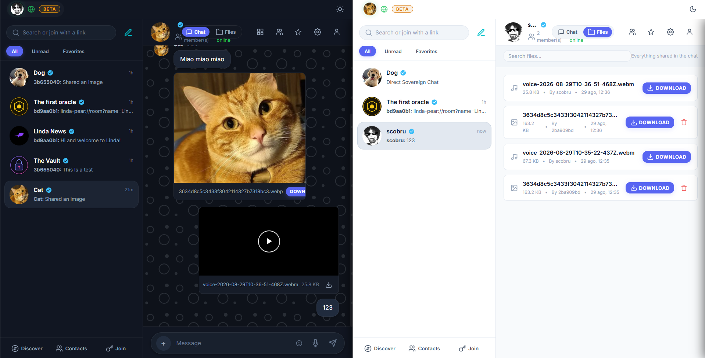
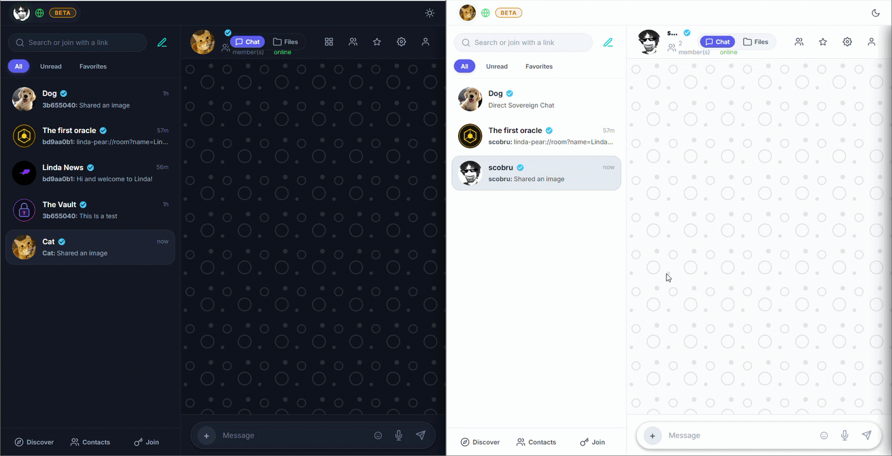

# linda-pear

P2P, serverless encrypted messenger built on the [Holepunch](https://holepunch.to) stack (autobase, hyperbee, hyperswarm, corestore). Desktop (Electron *or* the [Pear](https://docs.pears.com) runtime) and mobile (Expo + [react-native-bare-kit](https://github.com/holepunchto/react-native-bare-kit)) clients share one core in [`src/`](src/).

Same architecture Keet (Holepunch's own flagship app) uses under the hood — same `react-native-bare-kit` version, same primitives.

## Screenshots





## Repo layout

```
src/           shared core: identity, rooms (autobase), network (hyperswarm RPC), files (hyperdrive)
electron/      Electron main process (thin wrapper, no app logic)
index.html     GUI entrypoint for the Electron build
pear.js        app entrypoint for the Pear build — runs in Bare, starts the UI runtime
pear.html      GUI entrypoint for the Pear build
mobile/        Expo/React Native app; embeds src/ inside a Bare runtime worklet (mobile/worklet/)
test/          integration tests against real Hyperswarm
```

## Product Philosophy: Zero Relay Dependency

Linda is built from the ground up for sovereign individuals with **100% serverless, zero-infrastructure peer-to-peer communication**.

### Why No Voice or Video Calls?
This is a **deliberate product stance**, not a missing feature:
- **No Third-Party Relays**: Real-time WebRTC media streams across mobile networks (carrier CGNAT and symmetric NAT) strictly require TURN relay servers to proxy audio/video packets.
- **True Independence**: Operating dedicated TURN server fleets requires corporate infrastructure, ongoing server budgets, and centralized hosting. Linda is an independent, sovereign project without a corporate software house behind it.
- **Zero Trust & Sovereignty**: Relying on external or third-party relays introduces unvetted intermediaries that can log connection metadata, exhaust quotas, or silently fail. We refuse to depend on relays we do not control.

By eliminating real-time call plumbing entirely, Linda guarantees that all interactions—chat, encrypted file sharing, and identity discovery—operate exclusively over pure P2P primitives (Hyperswarm DHT, Autobase, Corestore, Hyperdrive) with zero centralized infrastructure.

## Unique Features

### 📁 Room Files (a second view over the chat)

There is no separate upload channel and no per-room drive. A file becomes a room file by being
sent in the chat, and the Files tab is an index over those messages:

- **One store, two views**: `sendFile` writes the bytes to the sender's own Hyperdrive and appends
  a chat message; `apply()` derives a file record (`name`, `size`, `mimeType`, `authorId`,
  `timestamp`, `driveKey`) into the linearized Hyperbee `state` log under `file/${messageId}`. The
  chat stream and the Files tab can never disagree about what the room holds, because they are the
  same log.
- **Multi-seeder P2P replication**: files ride the room's existing Hyperswarm connection — every
  peer that fetches one caches and reseeds it. No central server, no per-room discovery key.
- **Permissions**:
  - **Share & read**: all non-muted room members.
  - **Delete**: the message author, or the room Owner/Moderators.
- **Deletion is honest about its limits**: deleting removes the message and its file record for
  everyone, and removes the bytes from the deleter's own drive. Peers that already replicated the
  file keep their copy — nothing in a P2P system can reach out and un-send it.
- **Cross-platform UI**:
  - **Desktop**: tab switching `[ 💬 Chat ]` / `[ 📁 Files ]`, live search, direct downloads.
  - **Mobile**: segmented room controls, native sharing and streaming support.

### #️⃣ Hashtags (memo-style message tags)

Writing `buy milk #todo` in a message tags it, turning the tag into a clickable pill; the room can
then be filtered down to just the messages carrying a given tag — a lightweight way to use chat
as a running notes log without a separate feature for it.

- A tag must start with a letter (`#1`/`#2026` don't count) and is matched only at a word boundary,
  so a URL fragment like `example.com/page#section` is left alone.
- Tags are case-folded (`#Todo` and `#todo` are the same tag) and de-duplicated per message.
- Shared logic in [hashtag.ts](src/util/hashtag.ts): desktop renders it as inline HTML spans,
  mobile splits the message into text/tag parts since React Native renders text as nodes.

## Desktop

The same UI runs under two desktop runtimes. Both load `src/` — only the shell around it differs.

```bash
npm install
npm run start          # Electron: dev, single identity
npm run start:a        # Electron: separate storage dir (2nd peer for local testing)
npm run start:b
npm run start:pear     # Pear: pear run --dev . (needs the pear CLI: npx pear)
```

Build a distributable:

```bash
npm run make            # electron-forge → out/make/ (msix on win32, zip on darwin/linux)
```

### Electron vs Pear

|                     | Electron                          | Pear                                        |
| ------------------- | --------------------------------- | ------------------------------------------- |
| What ships          | Chromium + Node per app (~200 MB) | the app's own JS/CSS; the runtime is shared |
| Updates             | MSIX / GitHub Releases            | OTA over `pear://`, no installer            |
| JS runtime          | Node                              | [Bare](https://github.com/holepunchto/bare) |
| Module system       | CommonJS                          | ESM only — Bare has no `require`            |
| LAN discovery       | yes                               | no (see below)                              |

Pear is not "Electron, but lighter": it *is* Electron for drawing, but installed once and shared
by every Pear app on the machine, with the application itself reduced to its own source. What
changes for this codebase is the runtime underneath — Bare, not Node — which is the same runtime
the mobile worklet already runs on.

Two consequences shape the build:

- **Two bundles.** `build.js` emits `dist/app.js` (CommonJS, loaded by a plain `<script>` in
  `index.html`) for Electron and `dist/pear/app.js` (ESM, `<script type="module">` in `pear.html`)
  for Pear. Dependencies stay external in both: Electron resolves them out of the packaged
  `node_modules`, Pear out of the staged drive.
- **No Node builtins under Pear.** The Pear bundle rewrites `node:fs`/`node:path`/`node:os`/
  `node:http`/`node:events` to their `bare-*` equivalents at build time (see `BARE_BUILTINS` in
  `build.js`). `node:http` → `bare-http1` is the media server, and it is the mapping the mobile
  worklet has been running in production all along.

**LAN discovery is Electron-only.** mDNS needs UDP multicast, and `multicast-dns` reaches for it
through `node:dgram`, which Bare has no equivalent for — the same reason the module is kept out of
the mobile worklet's graph (see `SwarmTransport.createLanDiscovery` in
[`src/network/swarm.ts`](src/network/swarm.ts)). The Pear build swaps in
[`lan-discovery-stub.ts`](src/network/lan-discovery-stub.ts) and leaves the setting out of the
Network page.

**Which entrypoint is which.** `package.json` `main` belongs to Pear: v2 dropped HTML entrypoints,
so `pear run` boots `pear.js`, which starts `pear-electron` (the UI runtime) and `pear-bridge`
(which serves `pear.html` to it). Electron gets its entry from the explicit path in the `start`
scripts, and for packaged builds from the `packageAfterCopy` hook in `forge.config.cjs`, which
writes `main: electron/main.cjs` into the copy. Changing either one without the other breaks the
runtime it belongs to.

### Publishing (Pear P2P)

The app self-updates via the `upgrade` key in `package.json` (`pear://fe1g7q...`). To push a new version:

```bash
npm run pear:stage -- --dry-run   # preview
npm run pear:stage                # publish
npm run pear:seed                 # announce on the network (keep running)
```

The ignore list in `pear:stage` excludes `.dev-storage` (local test identities), build caches, the
`mobile/` app and the Electron half of the desktop build. It deliberately *keeps* `node_modules`,
minus the dev-only toolchain: the Pear bundle leaves its dependencies external, so the runtime
resolves them out of the staged drive — dropping `node_modules` there leaves the published app
with nothing to import.

To include the native Windows installer in the same `pear://` link (so `pear install` works, not just `pear run`):

```bash
npm run make
pear build --package package.json --target <empty-dir> --win32-x64-app out/make/msix/x64/linda-pear.msix
# copy <empty-dir>/by-arch into the repo root, then npm run pear:stage again
```

## Mobile (Expo)

```bash
cd mobile
npm run worklet          # rebuild the Bare worklet bundle (needed after touching src/ or worklet/entry.ts)
npm run android           # dev build + install on device/emulator
npm run ios
```

Release APK:

```bash
cd mobile/android
./gradlew.bat assembleRelease
```

**Monorepo gotcha:** Expo CLI's workspace-root auto-detection resolves the wrong directory for this repo's npm workspace layout, breaking the release JS bundle step. Two things paper over it — don't remove without testing a release build:
- `/index.js` at the repo root (bridges to `mobile/index.js`)
- `root`/`entryFile` overrides in `mobile/android/app/build.gradle`

**Cleartext gotcha:** media playback streams over plain HTTP on loopback (see below), which
Android blocks by default. `mobile/android/app/src/main/res/xml/network_security_config.xml`
permits it for `127.0.0.1` only, wired up by `android:networkSecurityConfig` in the manifest.
An `expo prebuild` regenerates the manifest and will drop that attribute — put it back, or
video and audio simply fail to start with no useful error.

## Media streaming

Audio and video play without downloading the file first. A small HTTP server bound to loopback
serves byte ranges straight out of the Hyperdrive, and the platform's own player does the
seeking — `node:http` in the Electron renderer (`src/files/media-server-node.ts`), `bare-http1`
inside the worklet on mobile (`mobile/worklet/media-server.ts`) and, in the Pear build, the same
desktop file with `node:http` rewritten to `bare-http1` — all three driving the same handler in
`src/files/media-server.ts`.

The URL carries a per-session token, since loopback is shared with every other process on the
machine. Requests without it are answered 404, exactly like a wrong path.

Streaming is why videos are practical at all: the previous path read the whole file into memory
(base64 across the IPC bridge on mobile), which a phone-recorded video will not survive.

## Roadmap

### Offline discovery on a local network

**Status:** implemented, opt-in, **desktop only**. See `src/network/lan-discovery.ts`.

Discovery used to be the only part of Linda that depended on the internet: peers found each other
through the Hyperswarm DHT, which bootstraps from three hardcoded hosts (`node1..3.hyperdht.org`),
with no fallback on a LAN with no uplink. `LanDiscovery` adds mDNS as a second, opt-in channel
alongside it — announcing (and browsing for) the same topic keys the DHT announces over multicast,
then connecting directly over TCP with the same Noise handshake Hyperswarm itself uses, so a peer
found either way lands on the exact same connection path (`handleConnection` in `swarm.ts`).

Precise about which half of the original claim this affects: **transport** was already direct
peer-to-peer with no relay (see *Zero Relay Dependency* above). It was only **rendezvous** that
needed the DHT.

The privacy trade-off flagged when this was still on the roadmap is why it defaults to off:
announcing a room topic on the LAN reveals that topic to everyone on the network. Turn it on in
Network Status ("Discover peers on local network") on desktop; it takes effect on the next restart.
Both channels can surface the same peer — `Session`'s `onConnection` handler dedupes by noise
public key, dropping whichever connection arrives second.

Not wired up on mobile: `LanDiscovery` depends on `multicast-dns`, which does a bare
`require('dgram')` — Node's `dgram` has no Bare-native shim, so that require is unresolvable in
the worklet, and `bare-pack` fails the whole Android bundle at *pack* time trying to link it, not
merely at runtime. `Session` takes `LanDiscovery` by injection (`SwarmTransport.createLanDiscovery`)
specifically so mobile's entry point can leave it out of the worklet's module graph entirely.
Fixing this for real needs a Bare-native `dgram`/UDP-multicast shim `multicast-dns` can run against,
verified on an actual device — not attempted here.

### Bluetooth mesh

**Status:** not implemented. **Partly feasible — with the caveat that "mesh" is the expensive word.**

One thing is unusually favourable here: **Linda's replication is transport-agnostic.**
`corestore.replicate()` takes any Node duplex stream — `Session` happens to hand it a
Hyperswarm socket, but nothing in the sync logic knows or cares. Any Bluetooth channel that can be
presented as a duplex stream would replicate rooms, messages and shared files with the existing code
unchanged. That is the hard part of most such projects, and it is already done.

What that leaves:

- **The channel.** BLE L2CAP connection-oriented channels give a real bidirectional byte stream —
  `createL2capChannel()` on Android (API 29, and this app's `minSdkVersion` is already 29) and
  `CBL2CAPChannel` on iOS 11+. Neither is exposed by `react-native-ble-plx`, so this needs a native
  module, plus a bridge into the Bare worklet where the networking actually lives.
- **Throughput.** BLE realistically lands in the tens of KB/s. Fine for text and presence; file
  and image attachments would be painful and would need to be gated or deprioritised.
- **Desktop.** The weakest link. BLE *peripheral* support in Node/Electron is poor and largely
  unmaintained. Phone-to-phone is plausible well before phone-to-desktop is.
- **iOS background.** CoreBluetooth heavily restricts background advertising and connection, so an
  iOS device would mostly work only with the app foregrounded.
- **"Mesh" specifically.** A single BLE hop between two devices in range is a different order of
  problem from multi-hop routing between devices that are *not* in range of each other. Multi-hop
  needs routing, store-and-forward, loop prevention and a story for what happens when the graph
  partitions. Briar does this and it is a substantial part of that project. Note also that
  *Bluetooth Mesh* is a specific BT SIG specification aimed at IoT sensor networks — it is not the
  right substrate for this, so the name is misleading for what is actually wanted here.

Honest framing: **single-hop BLE between two phones is a plausible piece of work.** Cross-platform
multi-hop mesh is a research-grade project, not a feature — worth splitting the two so the first
can ship without waiting on the second.

## Distribution

- **Desktop**: [GitHub Releases](https://github.com/scobru/linda/releases) (`.msix`, self-signed — Windows will warn on install) or `pear://fe1g7q7wqqjundb7t3pdz93tz7n9cm7sakr46mdg6ipg4tk15xno`
  - On a PC other than the one a build came from, the `.msix` install can be *blocked* rather than just warned about ("Editore: Sconosciuto" / the publisher certificate could not be verified, install button disabled): the package is signed with a dev certificate, not one issued by a public CA, so Windows only trusts it once that certificate has been imported. Each release also includes a `linda-pear-signing-cert.cer` — the double-click → "Install Certificate" wizard can silently land the cert in the *current user's* store instead of the machine-wide one it needs to be in (no error, it just doesn't fix the install), so the reliable way is PowerShell **as Administrator**:
    ```powershell
    Import-Certificate -FilePath "C:\path\to\linda-pear-signing-cert.cer" -CertStoreLocation Cert:\LocalMachine\TrustedPeople
    ```
    then retry the `.msix` install. If it's still blocked, sideloading may be off: Settings → Privacy & security → For developers → set "App install control" to "Anywhere" (or enable Developer Mode).
- **Android**: [GitHub Releases](https://github.com/scobru/linda/releases) (`.apk`, debug-signed beta)
- **iOS**: not built yet
- **macOS/Linux desktop**: [GitHub Releases](https://github.com/scobru/linda/releases) (`.zip`, unsigned — macOS/Linux will warn on first launch)

## Known issues

- Release APK is unsigned beyond the RN debug keystore — fine for beta distribution, not for a Play Store submission.
- Push notifications only fire while the app process is alive (foreground or backgrounded, not force-quit) — there's no server, so nothing can wake a fully-killed app. A relay to fix that would need to be opt-in and content-blind to keep the P2P privacy model.

## Testing

```bash
npm test                                 # everything, including two real Sessions over an in-process DHT
LINDA_TEST_DHT=public npm test           # same assertions against the public DHT instead
```

`test/session.test.ts` runs two `Session` instances against each other — real swarm, real RPC, real
replication — bootstrapped from an in-process `hyperdht` testnet rather than the public network. It
covers the join -> write-grant -> replicate path, which nothing else does. Every push runs the suite
(`.github/workflows/test.yml`).
